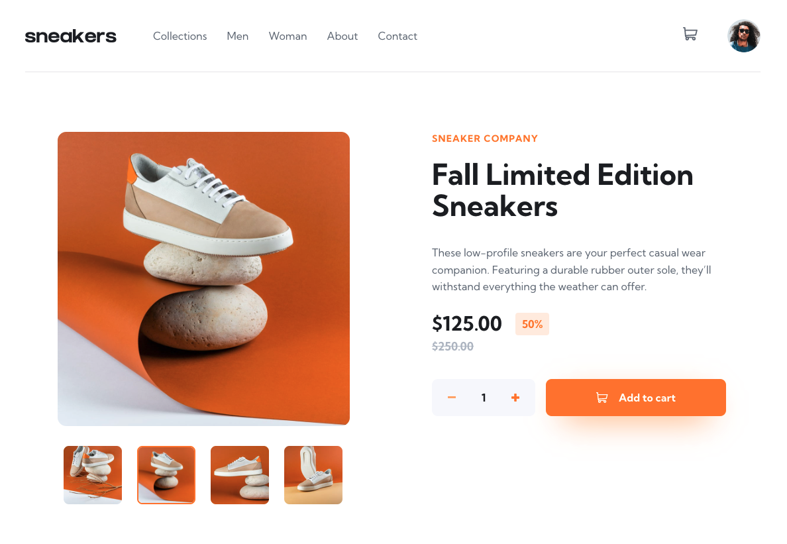

# Interactive comments section

This is a solution to the [E-commerce product page challenge on Frontend Mentor](https://www.frontendmentor.io/challenges/ecommerce-product-page-UPsZ9MJp6).

## Table of contents

- [Overview](#overview)
  - [Functionality](#functionality)
  - [Screenshot](#screenshot)
  - [Link](#link)
- [My process](#my-process)
  - [Built with](#built-with)
  - [What I learned](#what-i-learned)
- [Author](#author)

## Overview

Product cart page with slider and mobile-first layout.

### Functionality

Users are able to:

- View the optimal layout for the app depending on their device's screen size
- See hover states for all interactive elements on the page
- Open a lightbox gallery by clicking on the large product image
- Switch the large product image by clicking on the small thumbnail images
- Add items to the cart
- View the cart and remove items from it

### Screenshot

### Link

- Live Site URL: [Demo](https://wasatad.github.io/Product-Page/)

## My process

### Built with

- [Vue.js](https://vuejs.org/) - JS framework
- [Vuex.js](https://vuex.vuejs.org/) - State manager
- [SCSS](https://sass-lang.com/) - CSS pre-processor
- [Vue-Agile](https://github.com/lukaszflorczak/vue-agile) - A carousel component for Vue.js inspired by Slick

### What I learned

In this project, I focused on creating a good looking responsive layout. Also, I get a great practice in implementing and setting gallery component "Vue-Agile", and had an exercise in validation user's entered data (amount of products).

## Author

- Frontend Mentor - [@Wasatad](https://www.frontendmentor.io/profile/Wasatad)
- Telegram - [@kuznetsovtm](https://t.me/@kuznetsovtm)
